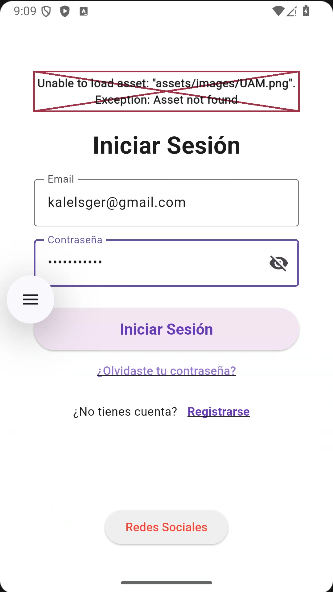
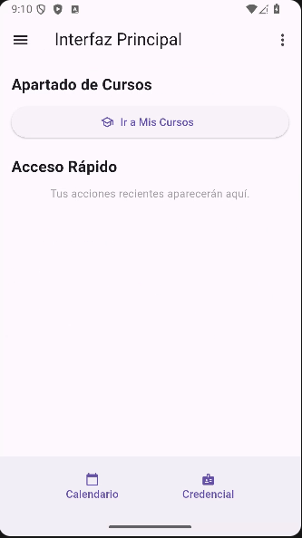
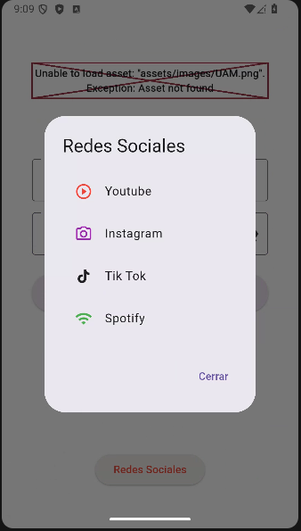

# Fénix | Sistema de Gestión y Notificación Universitaria

> proyecto creado para la **UAM Cuajimalpa**.

Fénix es una plataforma móvil diseñada para resolver la fragmentación de la comunicación institucional. El sistema centraliza la gestión de cursos, notificaciones académicas y acceso a servicios estudiantiles en una sola interfaz segura y eficiente.

## Galería de la Aplicación (MVP)

| Acceso Seguro | Panel Principal | Interacción Social |
| :---: | :---: | :---: |
|  |  |  |

## Logro Técnico e Integración
Este proyecto representa un ciclo de desarrollo completo (Full-Stack), desde el diseño de la base de datos relacional hasta la implementación de la interfaz móvil. 

**Características principales:**
- **Autenticación Robusta:** Flujo de inicio de sesión seguro vinculado a perfiles de usuario.
- **Arquitectura de Base de Datos:** Implementación en Supabase con lógica de seguridad a nivel de fila (RLS).
- **Gestión de Cursos:** Sistema dinámico para que profesores emitan notificaciones y alumnos consulten su oferta académica.
- **Enfoque en UX:** Interfaz limpia con acceso rápido a herramientas esenciales (Calendario, Credencial Digital).

## Stack Tecnológico
- **Frontend:** Flutter & Dart (Arquitectura desacoplada).
- **Backend:** Supabase (PostgreSQL).
- **Gestión de Estado:** `Provider` para una reactividad eficiente.
- **Seguridad:** Manejo de variables de entorno para protección de credenciales.

---
